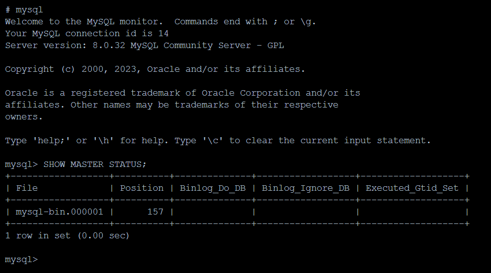
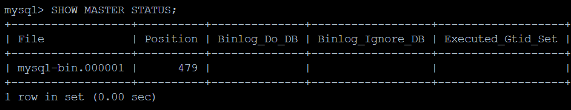
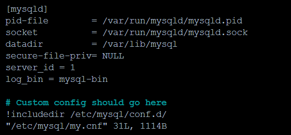
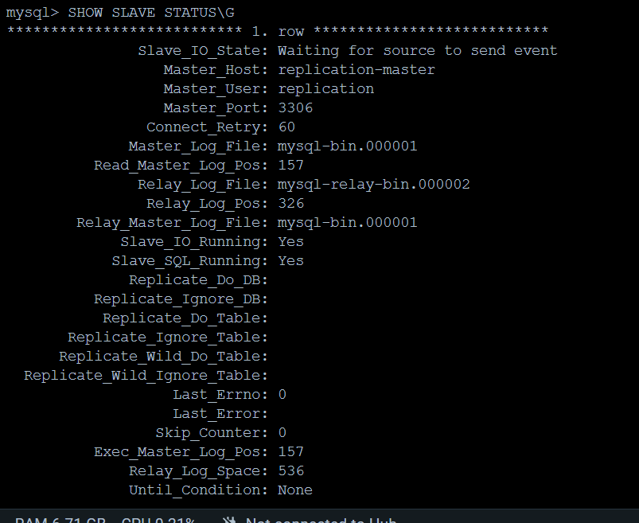
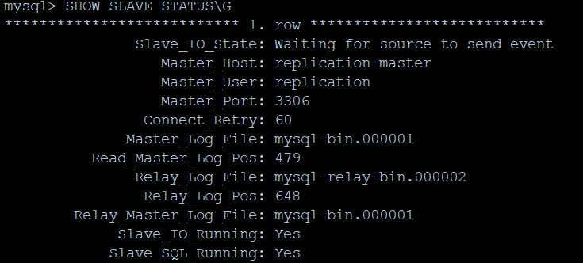
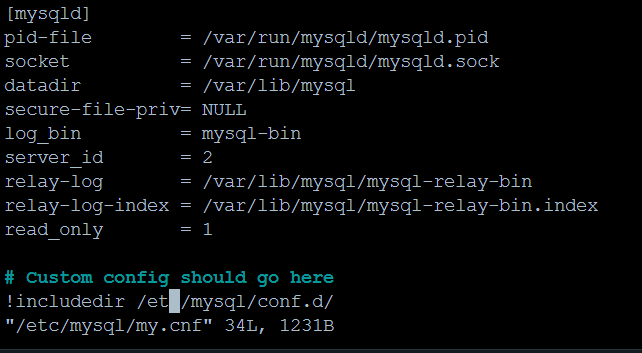

# Домашнее задание к занятию 12.6. «Репликация и масштабирование. Часть 1» - Гумлевой Александр

### Задание 1

На лекции рассматривались режимы репликации master-slave, master-master, опишите их различия.

В конфигурации master-slave записывать и изменять данные можно только на master, slave предназначены только для чтения. В конфигурации master-master читать и записывать можно на любой из узлов.

---

### Задание 2

Выполните конфигурацию master-slave репликации, примером можно пользоваться из лекции.

MASTER STATUS  
  

MASTER STATUS  после внесения данных
  

MASTER конфигурация  
  

SLAVE STATUS  
  
<details>
  <summary>SHOW SLAVE STATUS\G</summary>

  ```
mysql> SHOW SLAVE STATUS\G
*************************** 1. row ***************************
               Slave_IO_State: Waiting for source to send event
                  Master_Host: replication-master
                  Master_User: replication
                  Master_Port: 3306
                Connect_Retry: 60
              Master_Log_File: mysql-bin.000001
          Read_Master_Log_Pos: 157
               Relay_Log_File: mysql-relay-bin.000002
                Relay_Log_Pos: 326
        Relay_Master_Log_File: mysql-bin.000001
             Slave_IO_Running: Yes
            Slave_SQL_Running: Yes
              Replicate_Do_DB: 
          Replicate_Ignore_DB: 
           Replicate_Do_Table: 
       Replicate_Ignore_Table: 
      Replicate_Wild_Do_Table: 
  Replicate_Wild_Ignore_Table: 
                   Last_Errno: 0
                   Last_Error: 
                 Skip_Counter: 0
          Exec_Master_Log_Pos: 157
              Relay_Log_Space: 536
              Until_Condition: None
               Until_Log_File: 
                Until_Log_Pos: 0
           Master_SSL_Allowed: No
           Master_SSL_CA_File: 
           Master_SSL_CA_Path: 
              Master_SSL_Cert: 
            Master_SSL_Cipher: 
               Master_SSL_Key: 
        Seconds_Behind_Master: 0
Master_SSL_Verify_Server_Cert: No
                Last_IO_Errno: 0
                Last_IO_Error: 
               Last_SQL_Errno: 0
               Last_SQL_Error: 
  Replicate_Ignore_Server_Ids: 
             Master_Server_Id: 1
                  Master_UUID: 9d860410-b50c-11ed-9ab4-0242ac110002
             Master_Info_File: mysql.slave_master_info
                    SQL_Delay: 0
          SQL_Remaining_Delay: NULL
      Slave_SQL_Running_State: Replica has read all relay log; waiting for more updates
           Master_Retry_Count: 86400
                  Master_Bind: 
      Last_IO_Error_Timestamp: 
     Last_SQL_Error_Timestamp: 
               Master_SSL_Crl: 
           Master_SSL_Crlpath: 
           Retrieved_Gtid_Set: 
            Executed_Gtid_Set: 
                Auto_Position: 0
         Replicate_Rewrite_DB: 
                 Channel_Name: 
           Master_TLS_Version: 
       Master_public_key_path: 
        Get_master_public_key: 0
            Network_Namespace: 
1 row in set, 1 warning (0.01 sec)

mysql> 
  ```
</details>

SLAVE STATUS после внесения данных на MASTER  
  

SLAVE кофигурация  
  
